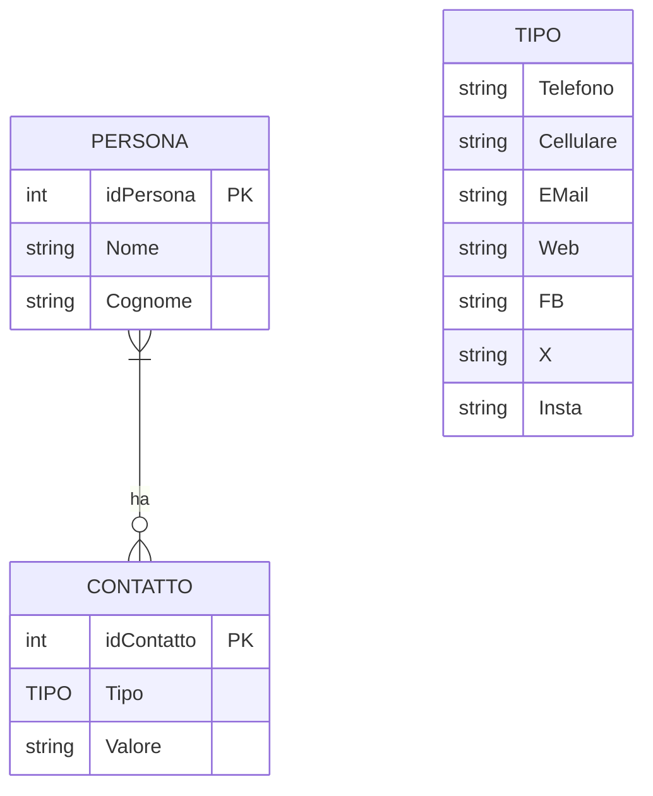

# Versione Uno A Molti di Rubrica
Esempi di doppia grid per visualizzare una relazione uno a molti

```mermaid
erDiagram
    PERSONA }|--o{ CONTATTO : ha
    PERSONA {
        int idPersona PK
        string Nome
        string Cognome
    }
    CONTATTO {
        int idContatto PK
        TIPO Tipo
        string Valore
    }
    TIPO {
        string Telefono
        string Cellulare
        string EMail
        string Web
        string FB
        string X
        string Insta
    }
```
